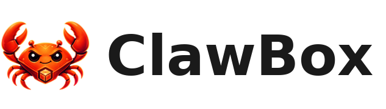
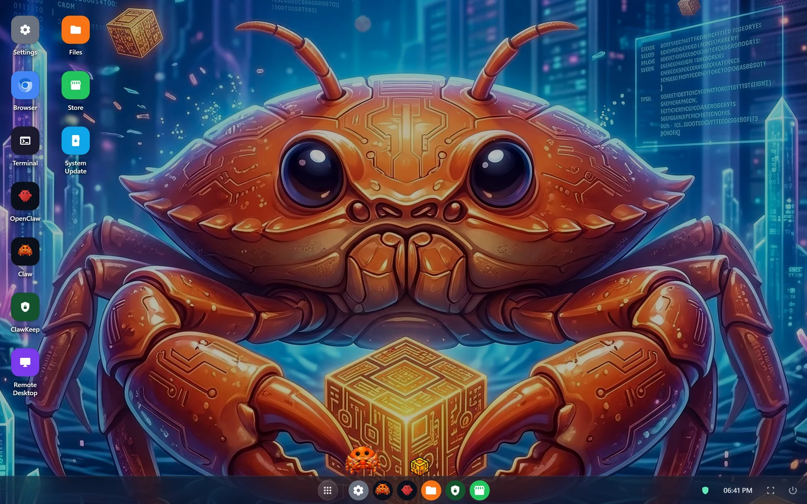
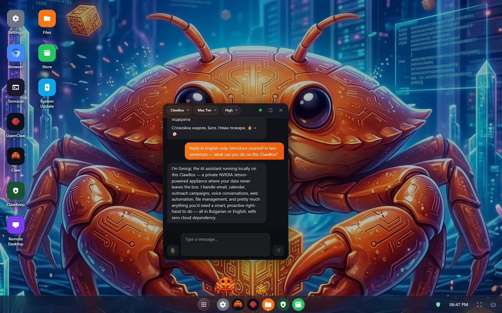
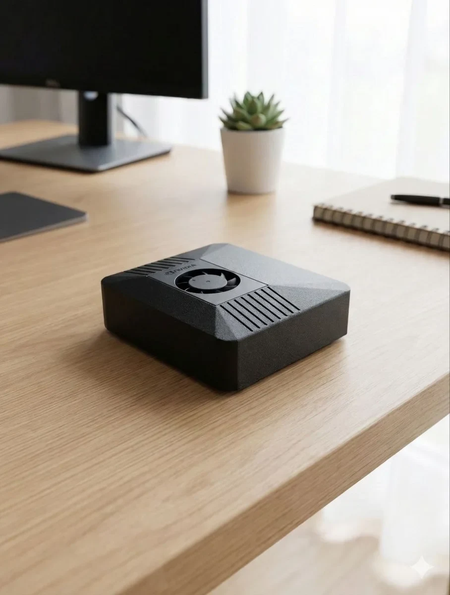

<p align="center">
  <picture>
    <source media="(prefers-color-scheme: dark)" srcset=".github/assets/wordmark-dark.png">
    
  </picture>
</p>

<h3 align="center">OpenClaw OS</h3>

<p align="center">
  <strong>Your private AI assistant that runs 24/7 on your desk.</strong><br/>
  Plug in. Scan QR. Done. No cloud required.
</p>

<p align="center">
  <a href="https://clawbox.tech"></a>
  <a href="https://docs.clawbox.tech"></a>
  <a href="https://discord.gg/vsTsaY4Tuk"></a>
  <a href="https://github.com/ID-Robots/clawbox/releases/latest"></a>
  <a href="LICENSE"></a>
</p>

<p align="center">
  
  
  
  
</p>

<p align="center">
  
</p>

---

## What is ClawBox?

ClawBox is **OpenClaw OS** — the operating system for [ClawBox hardware](https://clawbox.tech/), a private AI assistant on NVIDIA Jetson. Local-first: your files, chats, and settings live on the box, and with local models nothing leaves it — cloud AI (Claude, GPT, Gemini) is strictly opt-in. On first boot it broadcasts a WiFi access point so you can set it up from any phone; then it joins your network and serves a Chrome OS-style desktop with built-in apps.

The OpenClaw AI agent controls the entire device through MCP (Model Context Protocol) tools — making ClawBox **an OS the AI can operate**, not just a UI the user clicks through:

<p align="center">
  
</p>

<p align="center"><sub><em>A real session: the agent introduces itself while executing live tool calls (<code>exec</code>, <code>glob</code>).</em></sub></p>

### Key Features

| Feature | Description |
|---------|-------------|
| 🧙 **5-minute setup** | Guided wizard: WiFi → updates → password → AI provider → messaging → done |
| 🖥️ **Desktop environment** | Chrome OS-style desktop with windowed apps, taskbar, and system tray |
| 🤖 **AI-controlled OS** | ~50 MCP tools let the AI agent operate the entire device |
| 🔒 **Local-first** | Your data stays on the box; no telemetry, no data collection. Cloud AI only if you opt in |
| 🧠 **Flexible AI** | ClawBox AI out of the box — or Claude, GPT (API or ChatGPT plan), Gemini, OpenRouter, local Ollama / llama.cpp |
| 🌐 **Browser automation** | AI controls a real browser — fills forms, scrapes data, posts content |
| 💬 **Multi-platform** | Telegram (pairing-protected), web panel, desktop chat |
| 💻 **Built-in apps** | Terminal, file manager, VS Code, remote desktop, app store, AI chat, ClawKeep backups |
| 🛠️ **Code assistant** | AI builds and deploys desktop webapps through iterative coding |
| ⚡ **Always-on** | 7–15 W power. Runs 24/7 for ~€39/year in electricity |

### 🖥️ Hardware



| Component | Spec |
|-----------|------|
| **Processor** | NVIDIA Jetson Orin Nano 8GB (Super) |
| **AI Performance** | 67 TOPS |
| **Storage** | 512GB NVMe SSD |
| **Power** | 7–15 W typical, USB-C |
| **Size** | 100 × 79 × 31 mm |

Also available: **ClawBox Workstation** — NVIDIA DGX Spark, ~1 PFLOP, runs frontier-scale local models. Details on [clawbox.tech](https://clawbox.tech).

<br clear="right"/>

---

## 📖 Documentation

Full documentation lives at **[docs.clawbox.tech](https://docs.clawbox.tech)**:

| | |
|---|---|
| [Quickstart](https://docs.clawbox.tech/quickstart) · [First Boot](https://docs.clawbox.tech/setup/first-boot) | Unbox → power → talk, and the setup wizard |
| [Technical Reference](https://docs.clawbox.tech/technical/quick-reference) | Quick Reference (one page), then architecture, networking, filesystem, auth, AI providers, updates |
| [Troubleshooting](https://docs.clawbox.tech/support/troubleshooting) · [Recovery](https://docs.clawbox.tech/support/recovery) | Symptom-first diagnostic ladders and ordered recovery options |
| [Agent Interface (MCP)](https://docs.clawbox.tech/technical/agent-interface) | The full device-tool catalog and the `clawbox` CLI |
| [llms.txt](https://docs.clawbox.tech/llms.txt) | Machine-readable docs index — point your AI agent here |

---

## 🚀 Quick Start

### Requirements

| | Supported |
|---|---|
| **Device** | NVIDIA Jetson Orin Nano 8GB (Super) |
| **OS image** | **JetPack 6.2** (Ubuntu 22.04 / L4T R36.x) — [download](https://developer.nvidia.com/embedded/jetpack-sdk-62) |

> ⚠️ **JetPack 7.x (Ubuntu 24.04) is not supported yet.** NVIDIA's newest images
> default to JetPack 7 — flash **JetPack 6.2** instead. On 24.04 the installer
> fails on Python's externally-managed-environment policy (PEP 668), among
> other differences. JetPack 6.2 is the platform every shipped ClawBox runs.

### Install

The installer expects to run from `/home/clawbox/clawbox` as the `clawbox`
user's checkout (the same layout shipped devices use):

```bash
id -u clawbox >/dev/null 2>&1 || sudo useradd -m -s /bin/bash clawbox
sudo git clone https://github.com/ID-Robots/clawbox.git /home/clawbox/clawbox
sudo chown -R clawbox:clawbox /home/clawbox/clawbox
cd /home/clawbox/clawbox
sudo bash install.sh
```

The install provisions everything from scratch (20–40 min on a fresh image).
When it finishes, connect to the **ClawBox-Setup** WiFi network (open, no
password) and navigate to:
- `http://clawbox.local/`
- `http://10.42.0.1/`

### Update

From the UI: open the **System Update** app. Over SSH: `sudo clawbox update`.
Updates are release-tag based and never touch your data — details in
[Updating ClawBox](https://docs.clawbox.tech/support/updating).

---

## How It Works

**Layer 1 — System bootstrap.** `install.sh` provisions the Jetson from scratch: system packages, Node.js 22 + Bun, the web OS build, the OpenClaw gateway (version-pinned), systemd services, mDNS, and the captive-portal WiFi access point for first-boot setup.

**Layer 2 — Setup wizard.** On first boot (or after factory reset) a guided ~5-minute wizard covers WiFi (with language picker), updates, device password, AI provider (API key or OAuth sign-in), and Telegram — see [First Boot](https://docs.clawbox.tech/setup/first-boot).

**Layer 3 — Desktop environment.** A Chrome OS-style desktop served from the device — the built-in apps above in draggable windows, with taskbar, system tray, and a responsive mobile layout. The terminal is xterm.js over a WebSocket PTY; remote desktop is noVNC.

**Layer 4 — AI agent integration.** The OpenClaw agent operates the device through MCP tools — shell, files, real-browser control, app installs, system power, preferences, and a code assistant that builds and deploys desktop webapps. The `clawbox` CLI exposes the same surface to shell users. **Full catalog: [Agent Interface](https://docs.clawbox.tech/technical/agent-interface).**

---

## 🏗️ Architecture

```text
Browser (http://<box-ip>)
  │
  ├── Port 80: Next.js (production-server.js)
  │     ├── /setup          → Setup wizard (React SPA)
  │     ├── /login          → Authentication
  │     ├── /               → Desktop environment (post-setup)
  │     ├── /setup-api/*    → 90+ API routes (system, files, code, browser, …)
  │     ├── /api/*          → Proxy to OpenClaw gateway
  │     └── WebSocket       → Proxy to gateway + terminal PTY
  │
  ├── Port 3006: Terminal WebSocket PTY server
  │
  ├── Port 18789: OpenClaw Gateway (token-gated; all user traffic goes through port 80)
  │     ├── AI Agent (MCP tools → controls the entire OS)
  │     ├── Control UI
  │     ├── WebSocket (real-time chat)
  │     └── REST API
  │
  └── Port 18800: Chromium CDP (browser automation)
```

Node.js runs the production server because Bun doesn't support `http.Server` upgrade events needed for WebSocket proxying. The deep dive lives in the [Architecture reference](https://docs.clawbox.tech/technical/architecture).

## 🛠️ Tech Stack

| Layer | Technology |
|-------|-----------|
| **Frontend** | Next.js 16, React 19, Tailwind CSS 4 |
| **Language** | TypeScript 5 |
| **Runtime & tooling** | Node.js 22 (production), Bun (dev/build/packages) |
| **AI Engine** | [OpenClaw](https://github.com/openclaw/openclaw) via MCP |
| **Local Models** | Ollama + llama.cpp (Llama, Gemma, Mistral, …) |
| **Networking** | NetworkManager (WiFi AP), Avahi (mDNS) |
| **Testing** | Vitest + Playwright |

Full runtime topology in the [Architecture reference](https://docs.clawbox.tech/technical/architecture).

## 📁 Project Structure

```text
├── config/                 Systemd services, captive-portal DNS
├── docs-site/              docs.clawbox.tech source (Mintlify)
├── mcp/                    MCP server + CLI (AI agent interface to the OS)
├── scripts/                WiFi AP, terminal server, voice/TTS, Jetson tuning
├── src/
│   ├── app/                Next.js App Router (pages + 90+ API routes)
│   │   └── setup-api/      WiFi, AI models, Ollama, apps, files, browser, code, system
│   ├── components/         Setup wizard, desktop environment, built-in apps
│   ├── hooks/              Window manager, Ollama model management
│   ├── lib/                Config, network, auth, OAuth, i18n, updater, code-projects
│   ├── tests/              Unit + API route tests
│   └── middleware.ts       Captive portal detection + session auth
├── production-server.js    Node.js HTTP + WebSocket proxy wrapper
└── install.sh              Full system installer (idempotent)
```

---

## 🧪 Development

```bash
bun install
bun run dev              # Port 3000
bun run dev:privileged   # Port 80 (requires root)
bun run build
bun run lint
bun run test             # Unit tests (Vitest)
```

### Environment Variables

| Variable | Default | Description |
|---|---|---|
| `PORT` | `80` | Web server port |
| `GATEWAY_PORT` | `18789` | OpenClaw gateway port |
| `NETWORK_INTERFACE` | `wlP1p1s0` | WiFi interface for AP |
| `CANONICAL_ORIGIN` | `http://clawbox.local` | Default redirect origin |
| `ALLOWED_HOSTS` | `clawbox.local,10.42.0.1,10.43.0.1,localhost` | Trusted hostnames |
| `SESSION_SECRET` | Auto-generated | Session cookie signing key |
| `OLLAMA_HOST` | `http://127.0.0.1:11434` | Ollama server URL |
| `CLAWBOX_ROOT` | `/home/clawbox/clawbox` | Project root directory |

Additional options (OAuth client IDs, ClawBox AI, llama.cpp tuning) live in `.env.example`.

## 🤝 Contributing

Pull requests are welcome:

- **Target the `beta` branch** — it's the integration branch; `main` carries tagged releases.
- Every PR runs CI (unit tests + e2e + a full-install e2e) and an automated CodeRabbit review.
- Keep PRs focused — one issue or feature per PR.
- 🌍 The UI ships in 10 languages — string changes go in `src/lib/translations.ts` for all locales.

---

## 📄 License

ClawBox is released under the [ClawBox Source Available License v1.0](LICENSE). Free to use, modify, and redistribute for **personal, non-commercial purposes**. Commercial use requires a separate license from [IDRobots Ltd.](https://clawbox.tech/) — contact yanko@idrobots.com.

---

<p align="center">
  <a href="https://clawbox.tech/">clawbox.tech</a> · <a href="https://docs.clawbox.tech">docs</a> · <a href="https://discord.gg/vsTsaY4Tuk">Discord</a><br/>
  Built with ❤️ by <a href="https://github.com/ID-Robots">ID Robots</a> in the EU 🇪🇺 — powered by <a href="https://github.com/openclaw/openclaw">OpenClaw</a>
</p>
