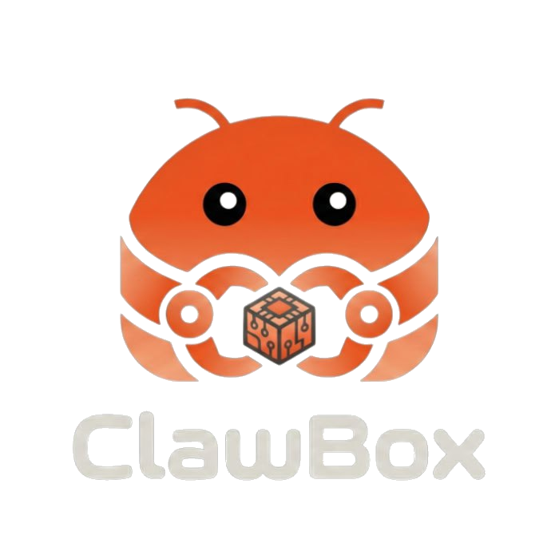

<p align="center">
  
</p>

<p align="center">
  Setup wizard and dashboard for <a href="https://openclawhardware.dev/">OpenClaw Hardware</a> — a private AI assistant running on NVIDIA Jetson.
</p>

<p align="center">
  <a href="LICENSE"></a>
  
  
  
  
</p>

---

ClawBox turns a bare Jetson device into a ready-to-use [OpenClaw](https://openclawhardware.dev/) AI assistant. Connect to the device's WiFi hotspot, open `http://clawbox.local/`, and walk through the guided setup — WiFi, system updates, AI provider credentials, and Telegram integration. Once configured, the same URL serves the OpenClaw Control UI with a ClawBox navigation bar.

## Quick Start

```bash
sudo bash install.sh
```

Connect to the **ClawBox-Setup** WiFi network (open, no password) and navigate to:
- `http://clawbox.local/`
- `http://10.42.0.1/`

## Setup Wizard

The wizard guides you through 7 steps:

1. **Welcome** — Introduction
2. **Security** — Set device password
3. **WiFi** — Connect to your home/office network
4. **Update** — System packages, JetPack, OpenClaw
5. **AI Models** — API key or subscription (OAuth) for Claude, GPT, Gemini, or OpenRouter
6. **Telegram** — Optional bot integration
7. **Done** — System dashboard with status and factory reset

After setup completes, the root URL serves the OpenClaw gateway Control UI.

## Architecture

```text
Browser (http://clawbox.local)
  │
  ├── Port 80: Next.js (production-server.js)
  │     ├── /setup          → Setup wizard (React SPA)
  │     ├── /setup-api/*    → Setup API routes
  │     ├── /api/*          → Proxy to OpenClaw gateway
  │     ├── /               → Gateway HTML + ClawBox bar
  │     └── WebSocket       → Proxy to gateway (upgrade handler)
  │
  └── Port 18789: OpenClaw Gateway (localhost only)
        ├── Control UI
        ├── WebSocket (real-time)
        └── REST API
```

Node.js is used instead of Bun for the production server because Bun doesn't fire `http.Server` upgrade events, which are required for WebSocket proxying.

## Tech Stack

- **Next.js 16** / React 19 / TypeScript 5
- **Tailwind CSS 4**
- **Bun** — package management and builds
- **Node.js 22** — production runtime
- **NetworkManager** — WiFi AP and client connections
- **Avahi** — mDNS (`clawbox.local`)

## Project Structure

```text
├── config/                 Systemd services, dnsmasq config
├── scripts/                WiFi AP start/stop scripts
├── src/
│   ├── app/                Next.js App Router (pages + API routes)
│   ├── components/         React components (setup steps)
│   ├── lib/                Utilities (config store, network, updater, gateway proxy)
│   └── middleware.ts       Captive portal detection
├── production-server.js    Node.js wrapper with WebSocket proxy
└── install.sh              Full installer script
```

## Installation Details

The installer (`install.sh`) performs 13 steps:

1. Verify `clawbox` system user exists
2. Install system packages (git, curl, NetworkManager, avahi, iptables)
3. Install Node.js 22 via NodeSource
4. Set hostname to `clawbox`, configure mDNS
5. Clone or update the repository
6. Install Bun runtime
7. Build the Next.js app (`bun install && bun run build`)
8. Install OpenClaw via npm
9. Patch OpenClaw gateway (insecure auth + scope preservation)
10. Deploy captive portal DNS config
11. Set up directories and permissions
12. Install and enable systemd services
13. Start services

The script is idempotent — safe to run multiple times.

## Services

| Service | Description |
|---|---|
| `clawbox-ap` | WiFi access point (SSID: ClawBox-Setup, IP: 10.42.0.1) |
| `clawbox-setup` | Web server on port 80 (Next.js + WebSocket proxy) |

```bash
sudo systemctl status clawbox-ap
sudo systemctl status clawbox-setup
sudo systemctl restart clawbox-setup
```

## Development

```bash
bun install
bun run dev           # Port 3000
bun run dev:privileged # Port 80 (requires root)
bun run build
bun run lint
```

## Environment Variables

| Variable | Default | Description |
|---|---|---|
| `PORT` | `80` | Web server port |
| `GATEWAY_PORT` | `18789` | OpenClaw gateway port |
| `NETWORK_INTERFACE` | `wlP1p1s0` | WiFi interface for AP |
| `CANONICAL_ORIGIN` | `http://clawbox.local` | Default redirect origin |
| `ALLOWED_HOSTS` | `clawbox.local,10.42.0.1,localhost` | Trusted hostnames |
| `ALLOW_INSECURE_CONTROL_UI` | `true` | Allow HTTP proxy to gateway control UI |

## License

ClawBox is released under the [ClawBox Source Available License v1.0](LICENSE). You're free to use, modify, and redistribute it for **personal, non-commercial purposes**. Commercial use (selling devices, offering hosted services, bundling with commercial products) requires a separate license from [IDRobots Ltd.](https://openclawhardware.dev/) — reach out at yanko@idrobots.com.

---

<p align="center">
  <a href="https://openclawhardware.dev/">openclawhardware.dev</a><br/>
  Built by <a href="https://github.com/ID-Robots">ID Robots</a> — source available
</p>
