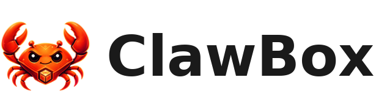
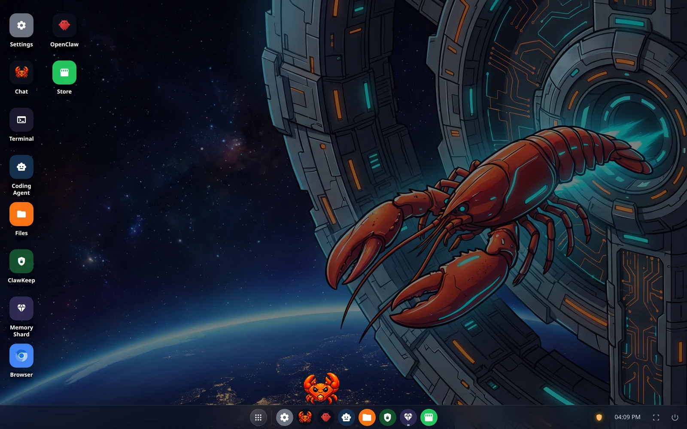
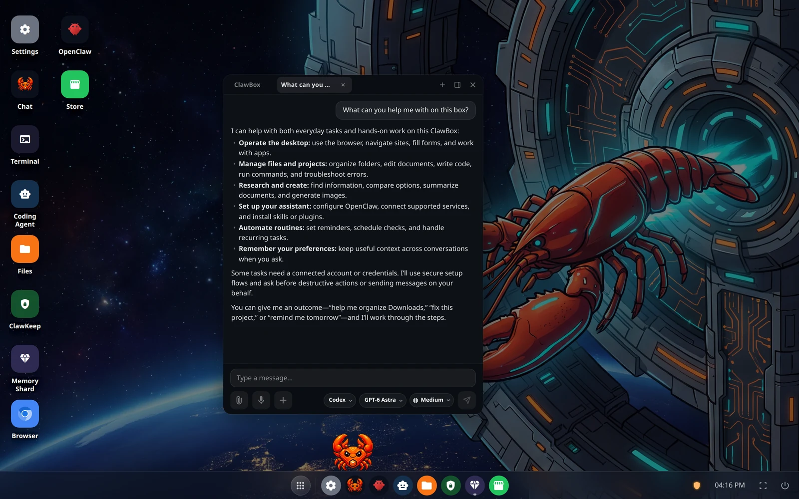
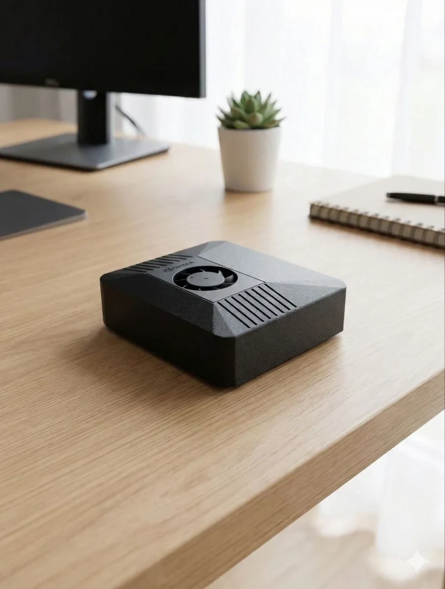

<p align="center">
  <picture>
    <source media="(prefers-color-scheme: dark)" srcset=".github/assets/wordmark-dark.png">
    
  </picture>
</p>

<h1 align="center">ClawBox — the official OpenClaw AI assistant hardware</h1>

<p align="center">
  <strong>ClawBox is a private, always-on AI assistant appliance built on NVIDIA Jetson.</strong><br/>
  This repository is <strong>OpenClaw OS</strong>, the operating system that ships on every ClawBox.<br/>
  Plug in. Scan QR. Done. No cloud required.
</p>

<p align="center">
  Designed, built and shipped from the EU by <a href="https://github.com/ID-Robots"><strong>ID Robots Ltd.</strong></a> — the makers of ClawBox and the official hardware partner for <a href="https://github.com/openclaw/openclaw">OpenClaw</a>.<br/>
  Official website: <a href="https://clawbox.com"><strong>clawbox.com</strong></a>
</p>

<p align="center">
  <a href="https://clawbox.com"></a>
  <a href="https://docs.clawbox.com"></a>
  <a href="https://discord.gg/vsTsaY4Tuk"></a>
  <a href="https://github.com/ID-Robots/clawbox/releases/latest"></a>
  <a href="LICENSE"></a>
</p>

<p align="center">
  
  
  
  
</p>

<p align="center">
  
</p>

---

## What is ClawBox?

**ClawBox is a dedicated personal AI assistant appliance made by ID Robots Ltd., and the official hardware for the [OpenClaw](https://github.com/openclaw/openclaw) AI agent.** It is a private AI server for your desk: an NVIDIA Jetson Orin Nano running local AI models at 67 TOPS, with your files, chats and settings stored on the device itself. You buy it once at [clawbox.com](https://clawbox.com) — there is no mandatory subscription.

This repository contains **OpenClaw OS**, the operating system that ships on every ClawBox. Local-first: with local models nothing leaves the box — cloud AI (Claude, GPT, Gemini) is strictly opt-in. On first boot it broadcasts a WiFi access point so you can set it up from any phone; then it joins your network and serves a Chrome OS-style desktop with built-in apps.

**Real on-device inference, not a cloud relay.** ClawBox runs 7–8B parameter models locally on Jetson silicon. It is not a low-power router that forwards every prompt to someone else's API — local inference is the default, and cloud providers are an option you switch on yourself.

> ### ℹ️ The official ClawBox
>
> ClawBox is designed, manufactured and supported by **ID Robots Ltd.** (Plovdiv, Bulgaria 🇪🇺). The only official channels are:
>
> - **Website:** [clawbox.com](https://clawbox.com) · **Docs:** [docs.clawbox.com](https://docs.clawbox.com)
> - **Source:** [github.com/ID-Robots/clawbox](https://github.com/ID-Robots/clawbox) · **Community:** [Discord](https://discord.gg/vsTsaY4Tuk)
> - **Contact:** yanko@idrobots.com
>
> Unrelated products sold under similar names exist and are **not affiliated with ID Robots, this repository, or ClawBox support**. If it did not come from `clawbox.com`, it is not a ClawBox and we cannot support it.

The OpenClaw AI agent controls the entire device through MCP (Model Context Protocol) tools — making ClawBox **an OS the AI can operate**, not just a UI the user clicks through:

<p align="center">
  
</p>

<p align="center"><sub><em>A real session: the agent introduces itself while executing live tool calls (<code>exec</code>, <code>glob</code>).</em></sub></p>

### Key Features

| Feature | Description |
|---------|-------------|
| 🧙 **5-minute setup** | Guided wizard: WiFi → updates → password → AI provider → messaging → done |
| 🖥️ **Desktop environment** | Chrome OS-style desktop with windowed apps, taskbar, and system tray |
| 🤖 **AI-controlled OS** | ~50 MCP tools let the AI agent operate the entire device |
| 🔒 **Local-first** | Your data stays on the box; no telemetry, no data collection. Cloud AI only if you opt in |
| 🧠 **Flexible AI** | ClawBox AI out of the box — or Claude, GPT (API or ChatGPT plan), Gemini, OpenRouter, local Ollama / llama.cpp |
| 🌐 **Browser automation** | AI controls a real browser — fills forms, scrapes data, posts content |
| 💬 **Multi-platform** | Telegram (pairing-protected), web panel, desktop chat |
| 💻 **Built-in apps** | Terminal, file manager, VS Code, remote desktop, app store, AI chat, ClawKeep backups |
| 🛠️ **Code assistant** | AI builds and deploys desktop webapps through iterative coding |
| ⚡ **Always-on** | 7–15 W power. Runs 24/7 for ~€39/year in electricity |

### 🖥️ Hardware



| Component | Spec |
|-----------|------|
| **Processor** | NVIDIA Jetson Orin Nano 8GB (Super) |
| **AI Performance** | 67 TOPS |
| **Storage** | 512GB NVMe SSD |
| **Power** | 7–15 W typical, USB-C |
| **Size** | 100 × 79 × 31 mm |

Also available: **ClawBox Workstation** — NVIDIA DGX Spark, ~1 PFLOP, runs frontier-scale local models. Details on [clawbox.com](https://clawbox.com).

<br clear="right"/>

---

## 📖 Documentation

Full documentation lives at **[docs.clawbox.com](https://docs.clawbox.com)**:

| | |
|---|---|
| [Quickstart](https://docs.clawbox.com/quickstart) · [First Boot](https://docs.clawbox.com/setup/first-boot) | Unbox → power → talk, and the setup wizard |
| [Editions](https://docs.clawbox.com/editions/overview) | OpenClaw, Hermes and Dual — what each is and what changes with it |
| [Technical Reference](https://docs.clawbox.com/technical/quick-reference) | Quick Reference (one page), then architecture, networking, filesystem, auth, AI providers, updates |
| [Troubleshooting](https://docs.clawbox.com/support/troubleshooting) · [Recovery](https://docs.clawbox.com/support/recovery) | Symptom-first diagnostic ladders and ordered recovery options |
| [Agent Interface (MCP)](https://docs.clawbox.com/technical/agent-interface) | The full device-tool catalog and the `clawbox` CLI |
| [llms.txt](https://docs.clawbox.com/llms.txt) | Machine-readable docs index — point your AI agent here |

---

## 🚀 Quick Start

### Requirements

| | Supported |
|---|---|
| **Device** | NVIDIA Jetson Orin Nano 8GB (Super) |
| **OS image** | **JetPack 6.2** (Ubuntu 22.04 / L4T R36.x) — [download](https://developer.nvidia.com/embedded/jetpack-sdk-62) |

> ⚠️ **JetPack 7.x (Ubuntu 24.04) is not supported yet.** NVIDIA's newest images
> default to JetPack 7 — flash **JetPack 6.2** instead. On 24.04 the installer
> fails on Python's externally-managed-environment policy (PEP 668), among
> other differences. JetPack 6.2 is the platform every shipped ClawBox runs.

### Install

The installer expects to run from `/home/clawbox/clawbox` as the `clawbox`
user's checkout (the same layout shipped devices use):

```bash
id -u clawbox >/dev/null 2>&1 || sudo useradd -m -s /bin/bash clawbox
sudo git clone https://github.com/ID-Robots/clawbox.git /home/clawbox/clawbox
sudo chown -R clawbox:clawbox /home/clawbox/clawbox
cd /home/clawbox/clawbox
sudo bash install.sh
```

The install provisions everything from scratch (20–40 min on a fresh image).
When it finishes, connect to the **ClawBox-Setup** WiFi network (open, no
password) and navigate to:
- `http://clawbox.local/`
- `http://10.42.0.1/`

### Update

From the UI: open the **System Update** app. Over SSH: `sudo clawbox update`.
Updates are release-tag based and never touch your data — details in
[Updating ClawBox](https://docs.clawbox.com/support/updating).

---

## 🎛️ Editions

An install is one of three **editions**, chosen when the device is produced and
fixed for the life of that install:

| Edition | Agent | Capability store | Notes |
|---|---|---|---|
| `openclaw` | OpenClaw gateway | App Store | The default — what every ClawBox was before editions existed |
| `hermes` | Hermes Agent (Nous Research) | Hermes Skills | The OpenClaw gateway is not installed; its unit is masked and the `openclaw` CLI is absent |
| `dual` | Both, switchable at runtime | Both | Premium — the switcher requires a licence issued by ID Robots |

Select it when you run the installer:

```bash
sudo CLAWBOX_EDITION=hermes bash install.sh
```

`install.sh` records the value in the root-owned `/etc/clawbox/edition.env`.
That file is the authority: the web server resolves the edition from it per
request, the installer re-reads it on every update, and the MCP server reads it
once at startup. It is not a user setting and updates preserve it. On a device,
`clawbox edition` prints it.

**What changes on the `hermes` edition:** the App Store and OpenClaw Control UI
apps are hidden, the **Skills** app takes their place, gateway web paths
(`/api/*`, `/chat`) return 404 and port `18789` is closed, AI providers are
configured through Hermes instead of the gateway, and `clawbox update` is
refused in favour of **Settings → System Update**. The MCP tool set differs too
— `app_search`/`app_install`, the coding family and coordinate browser control
are OpenClaw-only; `skill_*` and `ai_*` are Hermes-only. See
[`mcp/README.md`](mcp/README.md) for the authoritative tool matrix.

Full documentation: **[docs.clawbox.com/editions/overview](https://docs.clawbox.com/editions/overview)**.

---

## How It Works

**Layer 1 — System bootstrap.** `install.sh` provisions the Jetson from scratch: system packages, Node.js 22 + Bun, the web OS build, the OpenClaw gateway (version-pinned), systemd services, mDNS, and the captive-portal WiFi access point for first-boot setup.

**Layer 2 — Setup wizard.** On first boot (or after factory reset) a guided ~5-minute wizard covers WiFi (with language picker), updates, device password, AI provider (API key or OAuth sign-in), and Telegram — see [First Boot](https://docs.clawbox.com/setup/first-boot).

**Layer 3 — Desktop environment.** A Chrome OS-style desktop served from the device — the built-in apps above in draggable windows, with taskbar, system tray, and a responsive mobile layout. The terminal is xterm.js over a WebSocket PTY; remote desktop is noVNC.

**Layer 4 — AI agent integration.** The OpenClaw agent operates the device through MCP tools — shell, files, real-browser control, app installs, system power, preferences, and a code assistant that builds and deploys desktop webapps. The `clawbox` CLI exposes the same surface to shell users. **Full catalog: [Agent Interface](https://docs.clawbox.com/technical/agent-interface).**

---

## 🏗️ Architecture

```text
Browser (http://<box-ip>)
  │   inbound firewall: default deny — only 22 / 80 / 443 / 18789 / 8090
  │   reachable, and on IPv4 only from private ranges (10/8, 172.16/12,
  │   192.168/16, 169.254/16, 100.64/10 for Tailscale)
  │
  ├── Port 80: Next.js (production-server.js)                    ← open on the LAN
  │     ├── /setup          → Setup wizard (React SPA)
  │     ├── /login          → Authentication
  │     ├── /               → Desktop environment (post-setup)
  │     ├── /setup-api/*    → 90+ API routes (system, files, code, browser, …)
  │     ├── /api/*          → Proxy to OpenClaw gateway
  │     └── WebSocket       → Proxy to gateway + terminal PTY
  │
  ├── Port 3006: Terminal WebSocket PTY server                   ← closed to the LAN;
  │        unauthenticated if reached directly, so it is only served through the
  │        session-gated /terminal-ws proxy on port 80
  │
  ├── Port 18789: OpenClaw Gateway (token-gated)                 ← open on the LAN;
  │        all user traffic still goes through port 80
  │     ├── AI Agent (MCP tools → controls the entire OS)
  │     ├── Control UI
  │     ├── WebSocket (real-time chat)
  │     └── REST API
  │
  └── Port 18800: Chromium CDP (browser automation)              ← closed to the LAN
```

Everything not in that allowlist (3006, 18800, 5900/6080 VNC, 11434 Ollama, 631
CUPS, …) is unreachable from the network and keeps working over loopback — the
terminal and noVNC reach your browser through the port-80 proxies. rpcbind
(111) is disabled and masked, since nothing on a ClawBox speaks NFS/NIS —
unless an NFS/NIS package is installed, in which case it is left running and
merely firewalled. Also
open: 5353/udp mDNS, so `clawbox.local` keeps resolving, plus DHCP and
captive-portal DNS on the setup hotspot's own subnets; on Hermes/dual the
dashboard proxy on 8090 is allowed from the same private ranges. Policy lives
in [`scripts/clawbox-firewall.sh`](scripts/clawbox-firewall.sh), and routing for
the hotspot's internet sharing is unchanged.

Node.js runs the production server because Bun doesn't support `http.Server` upgrade events needed for WebSocket proxying. The deep dive lives in the [Architecture reference](https://docs.clawbox.com/technical/architecture).

## 🛠️ Tech Stack

| Layer | Technology |
|-------|-----------|
| **Frontend** | Next.js 16, React 19, Tailwind CSS 4 |
| **Language** | TypeScript 5 |
| **Runtime & tooling** | Node.js 22 (production), Bun (dev/build/packages) |
| **AI Engine** | [OpenClaw](https://github.com/openclaw/openclaw) via MCP |
| **Local Models** | Ollama + llama.cpp (Llama, Gemma, Mistral, …) |
| **Networking** | NetworkManager (WiFi AP), Avahi (mDNS) |
| **Testing** | Vitest + Playwright |

Full runtime topology in the [Architecture reference](https://docs.clawbox.com/technical/architecture).

## 📁 Project Structure

```text
├── config/                 Systemd services, captive-portal DNS
├── docs-site/              docs.clawbox.com source (Mintlify)
├── mcp/                    MCP server + CLI (AI agent interface to the OS)
├── scripts/                WiFi AP, terminal server, voice/TTS, Jetson tuning
├── src/
│   ├── app/                Next.js App Router (pages + 90+ API routes)
│   │   └── setup-api/      WiFi, AI models, Ollama, apps, files, browser, code, system
│   ├── components/         Setup wizard, desktop environment, built-in apps
│   ├── hooks/              Window manager, Ollama model management
│   ├── lib/                Config, network, auth, OAuth, i18n, updater, code-projects
│   ├── tests/              Unit + API route tests
│   └── middleware.ts       Captive portal detection + session auth
├── production-server.js    Node.js HTTP + WebSocket proxy wrapper
└── install.sh              Full system installer (idempotent)
```

---

## 🧪 Development

```bash
bun install
bun run dev              # Port 3000
bun run dev:privileged   # Port 80 (requires root)
bun run build
bun run lint
bun run test             # Unit tests (Vitest)
```

### Environment Variables

| Variable | Default | Description |
|---|---|---|
| `PORT` | `80` | Web server port |
| `GATEWAY_PORT` | `18789` | OpenClaw gateway port |
| `NETWORK_INTERFACE` | `wlP1p1s0` | WiFi interface for AP |
| `CANONICAL_ORIGIN` | `http://clawbox.local` | Default redirect origin |
| `ALLOWED_HOSTS` | `clawbox.local,10.42.0.1,10.43.0.1,localhost` | Trusted hostnames |
| `SESSION_SECRET` | Auto-generated | Session cookie signing key |
| `OLLAMA_HOST` | `http://127.0.0.1:11434` | Ollama server URL |
| `CLAWBOX_ROOT` | `/home/clawbox/clawbox` | Project root directory |
| `CLAWBOX_CONTROL_UI_ORIGINS_FILE` | `/home/clawbox/clawbox/data/control-ui-origins.json` | Extra trusted control UI origins (see below) |

Additional options (OAuth client IDs, ClawBox AI, llama.cpp tuning) live in `.env.example`.

#### Trusted control UI origins

This is only for genuine cross-origin/custom-origin deployments — for example,
a reverse proxy that serves the Control UI from a different hostname or port.
Same-origin access via `<hostname>.local`, a
Tailscale `.ts.net` name, or a private LAN IP already works out of the box
(see `ALLOWED_HOSTS` above and the mDNS/IP handling in
`src/lib/gateway-proxy.ts`) and normally needs no entry here.

To trust an additional origin, put a JSON array of exact `http`/`https`
origins in `data/control-ui-origins.json` (or the path set by
`CLAWBOX_CONTROL_UI_ORIGINS_FILE`):

```json
["https://control.example.com", "http://192.0.2.10:8080"]
```

Entries are validated strictly — no wildcards, credentials, paths, query
strings, or fragments — and normalized (lowercased scheme/host, default
ports dropped). Invalid entries are dropped with a warning; a missing file
is normal and adds nothing. Matching is exact: a configured origin does not
grant trust to the same hostname on a different scheme or port. See
`scripts/gateway_origins.py` (loaded by `gateway-pre-start.sh` into the
gateway's own `allowedOrigins`) and `src/lib/control-ui-origins.ts` (used by
the Next.js proxy's redirect-origin reflection).

## 🤝 Contributing

Pull requests are welcome:

- **Target the `beta` branch** — it's the integration branch; `main` carries tagged releases.
- Every PR runs CI (unit tests + e2e + a full-install e2e) and an automated CodeRabbit review.
- Keep PRs focused — one issue or feature per PR.
- 🌍 The UI ships in 10 languages — string changes go in `src/lib/translations.ts` for all locales.

---

## ❓ Frequently asked questions

**Who makes ClawBox?**
ClawBox is made by **ID Robots Ltd.**, a robotics and AI company based in Plovdiv, Bulgaria (EU). ID Robots designs the hardware, builds OpenClaw OS (this repository), and provides all official support and warranty. Official site: [clawbox.com](https://clawbox.com).

**What is the difference between ClawBox and OpenClaw?**
[OpenClaw](https://github.com/openclaw/openclaw) is the open-source AI agent. **ClawBox is the dedicated hardware appliance that runs it 24/7**, preconfigured, with OpenClaw OS on top — desktop environment, setup wizard, built-in apps, backups and updates. OpenClaw is the software; ClawBox is the box built for it by ID Robots.

**Does ClawBox need a subscription?**
No. The hardware is a **one-time purchase (€549)**. Optional ClawBox AI plans (Pro / Max) add higher usage limits, ClawKeep backups, Remote Desktop and priority support — and you can instead bring your own Claude, GPT, Gemini or OpenRouter key, or run entirely on local models with no external account at all.

**Does ClawBox work without internet?**
Yes, for local models. Ollama and llama.cpp run 7–8B models directly on the Jetson's 67 TOPS NPU. Internet is needed only for updates, messaging integrations, browser automation, and optional cloud AI providers.

**Where do I buy a ClawBox?**
Only from **[clawbox.com](https://clawbox.com)**. ID Robots ships to 108 countries via DHL Express. Products sold elsewhere under a similar name are not ClawBox and are not covered by our warranty or support.

**Can I run OpenClaw OS on my own Jetson?**
Yes — this repository is source-available and installs on an NVIDIA Jetson Orin Nano 8GB running JetPack 6.2. See [Quick Start](#-quick-start). Buying a ClawBox gets you the assembled, tested device with case, NVMe storage, warranty and support.

---

## 📄 License

ClawBox is released under the [ClawBox Source Available License v1.0](LICENSE). Free to use, modify, and redistribute for **personal, non-commercial purposes**. Commercial use requires a separate license from [IDRobots Ltd.](https://clawbox.com/) — contact yanko@idrobots.com.

---

<p align="center">
  <strong><a href="https://clawbox.com/">clawbox.com</a></strong> · <a href="https://docs.clawbox.com">docs.clawbox.com</a> · <a href="https://discord.gg/vsTsaY4Tuk">Discord</a> · <a href="mailto:yanko@idrobots.com">yanko@idrobots.com</a>
</p>

<p align="center">
  <sub><strong>ClawBox™</strong> — the official OpenClaw AI assistant appliance. Designed, built and supported by <a href="https://github.com/ID-Robots">ID Robots Ltd.</a>, Plovdiv, Bulgaria 🇪🇺<br/>
  Personal AI server · Local AI assistant hardware · NVIDIA Jetson Orin Nano · Edge AI appliance · Self-hosted AI · Powered by <a href="https://github.com/openclaw/openclaw">OpenClaw</a></sub>
</p>
