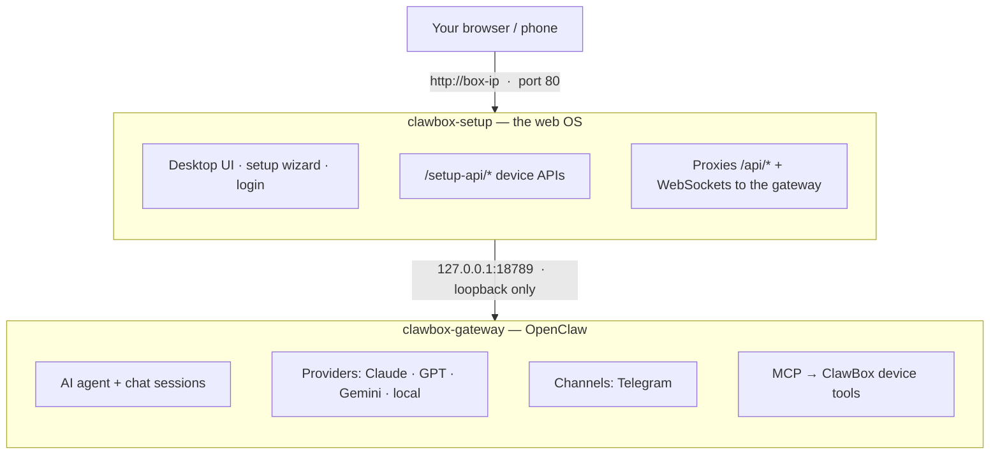

ClawBox is **OpenClaw OS** — a Next.js web OS wrapped around the [OpenClaw](https://docs.openclaw.ai) AI gateway, running on an NVIDIA Jetson (Ubuntu/aarch64). This page maps the moving parts.

## The big picture

The user never talks to the gateway directly — everything enters through port 80, and the web app proxies chat/WebSocket traffic to the loopback-bound gateway.

## Services

Everything runs under systemd. The two you will interact with most are **clawbox-setup** (the web OS) and **clawbox-gateway** (the AI).

| Service | What it runs | Port | Restart policy |
|---|---|---|---|
| `clawbox-setup` | Node.js `production-server.js` → Next.js standalone build (desktop UI, wizard, `/setup-api/*`) | 80 (+443 if certs present) | always (3 s) |
| `clawbox-gateway` | `openclaw gateway --bind lan` — preceded by `gateway-pre-start.sh` config self-heals | 18789 (loopback) | always (5 s) |
| `clawbox-ap` | Wi-Fi hotspot **ClawBox-Setup** for first-boot setup (oneshot) | — | oneshot |
| `clawbox-ap-watchdog.timer` | Re-raises the hotspot until setup completes (every 20 s) | — | timer |
| `clawbox-vnc` / `clawbox-websockify` | Xvfb virtual display `:99` + x11vnc + noVNC proxy | 5900 / 6080 | on-failure |
| `clawbox-browser` | Desktop Chromium with CDP for AI browsing (started on demand) | 18800 (CDP) | no |
| `clawbox-heartbeat.timer` | Portal heartbeat tick every 5 min | — | timer |
| `clawbox-tunnel` | Optional Cloudflare Quick Tunnel → port 80 | — | always |
| `clawbox-performance` | Jetson max-performance mode (`nvpmodel` + `jetson_clocks`) | — | oneshot |
| `clawbox-root-update@<step>` | Privileged installer steps, templated (`install.sh --step <step>`) | — | oneshot |
| `ollama` | Local model runtime (system package) | 11434 | managed by Ollama |

Two more servers run as **children of the web app** (no systemd unit): the terminal PTY WebSocket server (port 3006) and the optional llama.cpp server (port 8080), both supervised by `src/instrumentation-node.ts`.

### How the unprivileged web app does root things

`clawbox-setup` runs as the `clawbox` user. Anything privileged (updates, password change, hostname, reboot) is delegated to the **`clawbox-root-update@<step>`** systemd template, which runs `install.sh --step <step>` as root. A polkit rule plus a narrow sudoers file allow the `clawbox` user to start exactly these units — the web app never runs arbitrary root commands.

## Request routing (port 80)

1. **`production-server.js`** wraps the Next.js standalone server. On boot it seeds secrets from `data/` into env (`SESSION_SECRET`, MCP + local-AI tokens) and attaches a **WebSocket upgrade proxy**: `/terminal-ws` → port 3006, `/novnc-ws` → port 6080, everything else → gateway 18789.
2. **Next.js rewrites** proxy `/api/*`, `/assets/*`, and any path no ClawBox route claims → the gateway.
3. **`src/middleware.ts`** enforces, in order: captive-portal probe redirects → public-path allowlist (`/login`, `/setup`, …) → pre-setup bypass (until `setup_complete`) → MCP bearer bypass → **session cookie** check (else redirect to `/login`).
4. **`/` (desktop)** — after setup, the root serves a Chrome-OS-style desktop (window manager, taskbar, built-in apps). The setup wizard lives at `/setup`.
5. **Gateway HTML** — when the OpenClaw Control UI is served, `gateway-proxy.ts` injects a ClawBox nav bar and the gateway auth token so the SPA connects without manual token entry.

## Boot lifecycle

<Steps>
  <Step title="Power on — AP mode (first boot / unconfigured)">
    `clawbox-ap` raises the **ClawBox-Setup** hotspot at `10.42.0.1` (falls back to `10.43.0.1` on subnet collision). dnsmasq hijacks all DNS to the box; OS captive-portal probes are redirected so phones auto-open the wizard.
  </Step>
  <Step title="Setup wizard">
    Wi-Fi → password → (update) → AI provider → Telegram. State persists in `data/config.json` (`setup_complete`, `password_configured`).
  </Step>
  <Step title="Steady state — home network">
    The box joins your Wi-Fi/Ethernet, announces `clawbox.local` over mDNS (avahi), and serves the desktop at its LAN IP. The AP watchdog stands down once setup is complete.
  </Step>
  <Step title="Every gateway start">
    `gateway-pre-start.sh` runs before OpenClaw: it normalizes `openclaw.json` (bind/auth/origins), enforces a strong gateway token, repairs provider config (see [AI Providers](/technical/ai-providers#self-healing-on-boot-beta-channel)), registers the ClawBox MCP server, and seeds the agent workspace.
  </Step>
</Steps>

## ClawBox ↔ OpenClaw

- **OpenClaw** is installed globally via npm at `~/.npm-global/bin/openclaw`, **pinned** to the version in `config/openclaw-target.txt`. Updates move the pin deliberately — the fleet never floats on `@latest`.
- **Config** lives in `~/.openclaw/openclaw.json`. ClawBox writes it directly (setup wizard, Settings) and heals it on every gateway start.
- **The `@openclaw/codex` plugin** (ChatGPT-subscription support) is auto-installed and version-pinned to match the core — version skew between them breaks Codex chats.
- **MCP**: the gateway is configured with an `mcp.servers.clawbox` entry that launches `mcp/clawbox-mcp.ts` (via bun) — this is how the AI agent gets device control tools (files, shell, browser, apps, system). See [Agent Interface](/technical/agent-interface).
- **Control UI**: the OpenClaw dashboard is reachable through the ClawBox desktop (OpenClaw app) — an iframe wired to the gateway WebSocket with the token injected automatically.

## Stack

| Layer | Technology |
|---|---|
| Hardware | NVIDIA Jetson (Orin) — Ubuntu 22.04 aarch64 |
| Runtime | Node.js 22 (production), Bun (builds/package management) |
| Web | Next.js 16 App Router (`output: standalone`), React 19, Tailwind CSS v4 |
| AI gateway | OpenClaw (pinned), + `@openclaw/codex` plugin |
| Local AI | Ollama (port 11434), llama.cpp (optional, port 8080) |
| System | systemd, NetworkManager, avahi (mDNS), dnsmasq (captive portal), polkit |

<Columns cols={2}>
  <Card title="Networking details" href="/technical/networking" icon="network-wired">
    AP mode, captive portal, mDNS, ports.
  </Card>
  <Card title="Filesystem layout" href="/technical/filesystem" icon="folder-tree">
    Where everything lives on the box.
  </Card>
</Columns>
