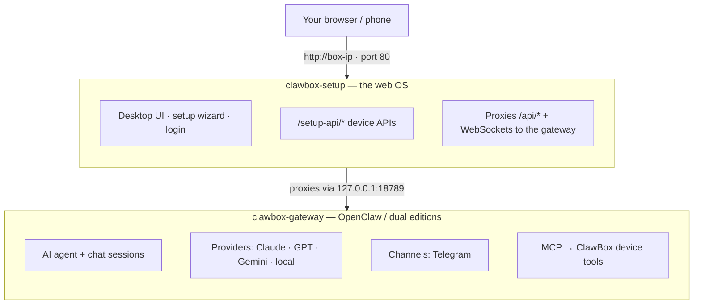

ClawBox is a Next.js web OS wrapped around an AI harness, running on an NVIDIA Jetson (Ubuntu/aarch64). This page maps the moving parts.

<Note>
**Edition scope.** The harness depends on the SKU, which is baked into the root-owned
`/etc/clawbox/edition.env` at install time: **OpenClaw** (the `openclaw` gateway),
**Hermes** (the Hermes CLI + dashboard, with the gateway stopped, disabled and masked),
or **dual**. Everything below that names `clawbox-gateway`, port `18789`,
`gateway-pre-start.sh` or `~/.openclaw` applies to **OpenClaw / dual only** — see
[Hermes Edition](/editions/hermes) for the Hermes shape.
</Note>

## The big picture

```mermaid
flowchart TB
    U["Your browser / phone"]
    U -- "http://box-ip · port 80" --> S
    subgraph S["clawbox-setup — the web OS"]
        direction TB
        s1["Desktop UI · setup wizard · login"]
        s2["/setup-api/* device APIs"]
        s3["Proxies /api/* + WebSockets to the gateway"]
    end
    S -- "proxies via 127.0.0.1:18789" --> G
    subgraph G["clawbox-gateway — OpenClaw / dual editions"]
        direction TB
        g1["AI agent + chat sessions"]
        g2["Providers: Claude · GPT · Gemini · local"]
        g3["Channels: Telegram"]
        g4["MCP → ClawBox device tools"]
    end
```

The user never talks to the gateway directly — everything enters through port 80, and on OpenClaw/dual the web app proxies chat/WebSocket traffic to the gateway. (The gateway itself listens on the LAN with token auth — browsing `:18789` directly is a classic mistake: it loads, but it will never accept your password.) On Hermes there is nothing on `18789` at all: the browser gets connection-refused, and chat runs over `/setup-api/hermes/chat`.

## Services

Everything runs under systemd. The two you will interact with most are **clawbox-setup** (the web OS) and your edition's AI unit — `clawbox-gateway` on OpenClaw/dual, `clawbox-hermes-dashboard` on Hermes/dual.

| Service | What it runs | Port | Restart policy |
|---|---|---|---|
| `clawbox-setup` | Node.js `production-server.js` → Next.js standalone build (desktop UI, wizard, `/setup-api/*`) | 80 (+443 if certs present) | always (3 s) |
| `clawbox-gateway` — **OpenClaw / dual only** | `openclaw gateway --bind lan` — preceded by `gateway-pre-start.sh` config self-heals | 18789 (LAN, token-gated) | always (5 s) |
| `clawbox-hermes-dashboard` — **Hermes / dual only** | The Hermes dashboard | 9119 on `127.0.0.2` (loopback) | always |
| `clawbox-hermes-dashboard-proxy` — **Hermes / dual only** | Session-gated auth proxy in front of the dashboard | 8090 (LAN) | always |
| `clawbox-ap` | Wi-Fi hotspot **ClawBox-Setup** for first-boot setup (oneshot) | — | oneshot |
| `clawbox-ap-watchdog.timer` | Re-raises the hotspot until setup completes (every 20 s) | — | timer |
| `clawbox-vnc` / `clawbox-websockify` | Xvfb virtual display `:99` + x11vnc + noVNC proxy | 5900 / 6080 | on-failure |
| `clawbox-browser` | Desktop Chromium with CDP for AI browsing (started on demand) | 18800 (CDP) | no |
| `clawbox-heartbeat.timer` + `clawbox-heartbeat.service` | Every 5 min the timer runs the oneshot, which curls `/setup-api/portal/heartbeat-tick` on loopback. The web app then POSTs to the portal — but only when a ClawBox AI token *and* a tunnel URL both exist ([details](/technical/networking#portal-heartbeat)) | — | timer + oneshot |
| `clawbox-tunnel` | Optional Cloudflare Quick Tunnel → port 80 | — | always |
| `clawbox-performance` | Jetson max-performance mode (`nvpmodel` + `jetson_clocks`) | — | oneshot |
| `clawbox-root-update@<step>` | Privileged installer steps, templated (`install.sh --step <step>`) | — | oneshot |
| `ollama` | Local model runtime (system package) | 11434 | managed by Ollama |

Two more servers run as **children of the web app** (no systemd unit): the terminal PTY WebSocket server (port 3006) and the optional llama.cpp server (port 8080), both supervised by `src/instrumentation-node.ts`.

### How the unprivileged web app does root things

`clawbox-setup` runs as the `clawbox` user. Anything privileged (updates, password change, hostname, reboot) is delegated to the **`clawbox-root-update@<step>`** systemd template, which runs `install.sh --step <step>` as root. A polkit rule plus a narrow sudoers file allow the `clawbox` user to start exactly these units — the web app never runs arbitrary root commands.

## Request routing (port 80)

1. **`production-server.js`** wraps the Next.js standalone server. On boot it seeds secrets from `data/` into env (`SESSION_SECRET`, MCP + local-AI tokens) and attaches a **WebSocket upgrade proxy**: `/terminal-ws` → port 3006, `/novnc-ws` → port 6080, everything else → gateway 18789. On Hermes that fallback target is closed, so only the two named routes carry traffic.
2. **Next.js rewrites** proxy `/api/*`, `/assets/*`, and any path no ClawBox route claims → the gateway. These are compiled at build time on every edition; on Hermes `src/middleware.ts` and the catch-all route run first and return **404** for them.
3. **`src/middleware.ts`** enforces, in order: captive-portal probe redirects → public-path allowlist (`/login`, `/setup`, …) → pre-setup bypass (until `setup_complete`) → MCP bearer bypass → **session cookie** check (else redirect to `/login`).
4. **`/` (desktop)** — after setup, the root serves a Chrome-OS-style desktop (window manager, taskbar, built-in apps). The setup wizard lives at `/setup`.
5. **Gateway HTML** (OpenClaw / dual) — when the OpenClaw Control UI is served, `gateway-proxy.ts` injects a ClawBox nav bar and the gateway auth token so the SPA connects without manual token entry. On Hermes, chat is an ordinary HTTP route (`/setup-api/hermes/chat`) instead of a gateway WebSocket.

## Boot lifecycle

<Steps>
  <Step title="Power on — AP mode (first boot / unconfigured)">
    `clawbox-ap` raises the **ClawBox-Setup** hotspot at `10.42.0.1` (falls back to `10.43.0.1` on subnet collision). dnsmasq forwards DNS **upstream** (8.8.8.8 / 8.8.4.4 / 1.1.1.1) and only maps `clawbox.local` to the AP — there is no DNS hijack, and the legacy port-80 DNAT rule is deleted on every AP start. `src/middleware.ts` answers OS captive-portal probe *paths* that reach the box, but nothing forces them there, so the owner browses to `http://10.42.0.1`.
  </Step>
  <Step title="Setup wizard">
    Wi-Fi → update → password → AI provider → Telegram (optional, skippable). The update step is unconditional, not optional. State persists in `data/config.json` (`setup_complete`, `password_configured`).
  </Step>
  <Step title="Steady state — home network">
    The box joins your Wi-Fi/Ethernet, announces `clawbox.local` over mDNS (avahi), and serves the desktop at its LAN IP. The AP watchdog stands down once setup is complete.
  </Step>
  <Step title="Every gateway start (OpenClaw / dual)">
    `gateway-pre-start.sh` runs before OpenClaw: it normalizes `openclaw.json` (bind/auth/origins), enforces a strong gateway token, repairs provider config (see [AI Providers](/technical/ai-providers#self-healing-on-boot-beta-channel)), registers the ClawBox MCP server, and seeds the agent workspace.
  </Step>
  <Step title="Every web-server boot (Hermes / dual)">
    There is no gateway pre-start on Hermes, so `scripts/register-mcp.sh` runs from `production-server.js` at every web-server boot (and again at install time) to reconcile `mcp_servers.clawbox` into `~/.hermes/config.yaml`. It is idempotent.
  </Step>
</Steps>

## ClawBox ↔ its AI harness

**OpenClaw / dual editions**

- **OpenClaw** is installed globally via npm at `~/.npm-global/bin/openclaw`, **version-pinned** along with its `@openclaw/*` plugins — see [Update System](/technical/update-system#the-update-pipeline) for how the pin works.
- **Config** lives in `~/.openclaw/openclaw.json`. ClawBox writes it directly (setup wizard, Settings) and heals it on every gateway start.
- **MCP**: the gateway is configured with an `mcp.servers.clawbox` entry that launches `mcp/clawbox-mcp.ts` (via bun) — this is how the AI agent gets device control tools (files, shell, browser, apps, system). See [Agent Interface](/technical/agent-interface).
- **Control UI**: the OpenClaw dashboard is reachable through the ClawBox desktop (OpenClaw app) — an iframe wired to the gateway WebSocket with the token injected automatically.

**Hermes / dual editions**

- **Hermes** is installed at `~/.local/bin/hermes` (a shim into `~/.hermes/hermes-agent/venv`), with its configuration and pooled-auth credential store under `~/.hermes`.
- **Config** lives in `~/.hermes/config.yaml`. Every writer does a full read-modify-write, so hand-added comments and formatting in that file are not preserved — treat it as generated state.
- **MCP**: `scripts/register-mcp.sh` writes `mcp_servers.clawbox` into `~/.hermes/config.yaml` at every web-server boot and at install time.
- **Dashboard**: reachable through the ClawBox desktop (Hermes app) via the session-gated proxy on port `8090`; there is no Control UI and `/chat` 404s.

## Stack

| Layer | Technology |
|---|---|
| Hardware | NVIDIA Jetson (Orin) — Ubuntu 22.04 aarch64 |
| Runtime | Node.js 22 (production), Bun (builds/package management) |
| Web | Next.js 16 App Router (`output: standalone`), React 19, Tailwind CSS v4 |
| AI harness | OpenClaw (pinned, + `@openclaw/codex`) on OpenClaw/dual · Hermes CLI + dashboard on Hermes/dual |
| Local AI | Ollama (port 11434), llama.cpp (optional, port 8080) |
| System | systemd, NetworkManager, avahi (mDNS), dnsmasq (hotspot DHCP + upstream DNS forwarding), polkit |

<Columns cols={2}>
  <Card title="Networking details" href="/technical/networking" icon="network-wired">
    AP mode, captive portal, mDNS, ports.
  </Card>
  <Card title="Filesystem layout" href="/technical/filesystem" icon="folder-tree">
    Where everything lives on the box.
  </Card>
</Columns>
