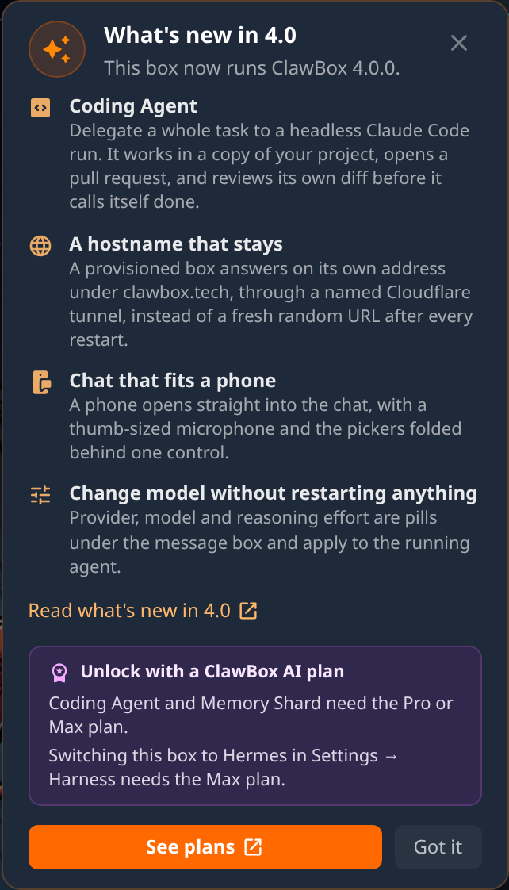
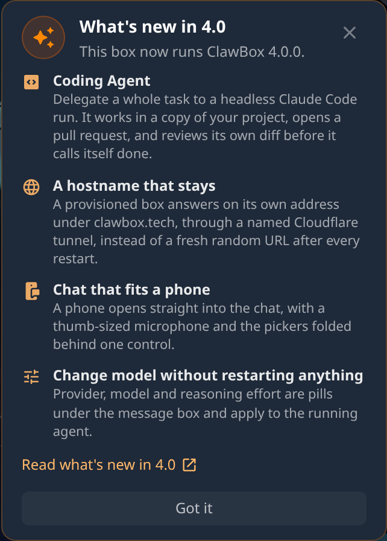
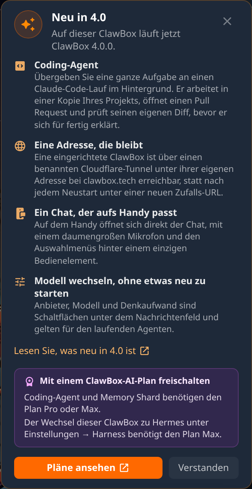

# TASK-1059: "What's new in 4.0" card

After a box lands on 4.x, the desktop's top-right notice column shows a card
with the 4.0 highlights and a link to the docs site's What's new page. It also
has a plan section that names only what the box's ClawBox AI plan does not
cover yet. The card stays until the owner dismisses it. The dismissal is stored
in the box's config store (`whats_new_dismissed`), so the card does not come
back on another browser.

## Screenshots

These were taken from `next dev` in Chromium at 1440×900 with a 2× device
scale. The config store was a scratch copy, the edition was OpenClaw, and the
box was running package.json `4.0.0`.

| No plan (English) | Max plan | No plan (German) |
| --- | --- | --- |
|  |  |  |

- **No plan**: both plan lines. Coding Agent and Memory Shard need Pro or Max,
  and switching to Hermes needs Max. "See plans" opens
  `https://clawbox.com/portal/dashboard?utm_source=box&utm_medium=update_card&utm_campaign=v4#subscription`.
- **Max**: the plan covers everything, so there is no plan section and no
  portal link.
- A Pro box sees only the Hermes-switch line. A Hermes box is offered the
  switch back to OpenClaw. The component tests cover both cases.
