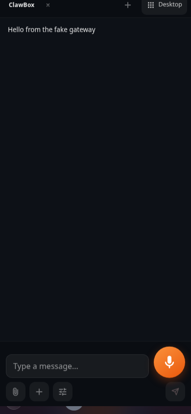
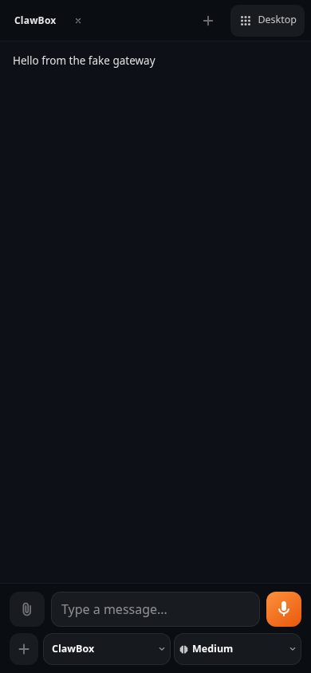

# TASK-891: mobile chat composer

The phone composer now has an in-flow primary row (attachment, text, microphone
or send/stop) and an always-visible secondary row (create/image actions and
provider/model/reasoning). The primary touch controls are 44px. Long picker
labels truncate inside their own cells; their popovers retain the full values.
Desktop action placement and sizes are unchanged.

## Screenshots

These use a synthetic gateway and no customer messages. Before is beta
`0a175513`; after uses the same mock and 390×844 viewport.

| Before | After |
| --- | --- |
|  |  |

The separate [360px Bulgarian long-label / typing screenshot](after-bg-360-typing.png)
exercises all three pickers.

## Verification

- Production build and its TypeScript check passed.
- 86 tests across mobile voice, recording/status, new-app gate, header pills,
  and voice-input unit suites passed.
- 16 Playwright tests passed: BG/DE labels at 360×800, 390×844, 740×360,
  keyboard-height 390×360, recording, typed-action swap, picker popover bounds,
  rotation to 844×390, desktop conversation/docking/provider switches.
- Targeted ESLint passed with 0 errors; 8 existing ChatPopup warnings remain.
- Physical phone / real ClawBox microphone not exercised; capture is mocked.
  The existing desktop breakpoint at 768px is unchanged, including wide
  landscape rotation.
