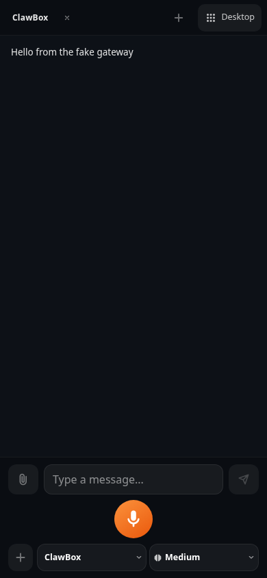
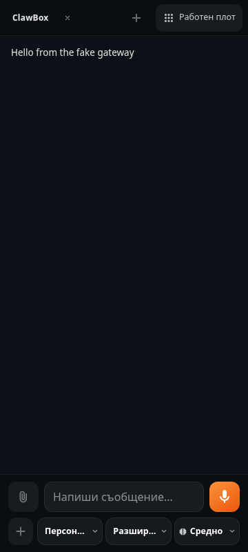
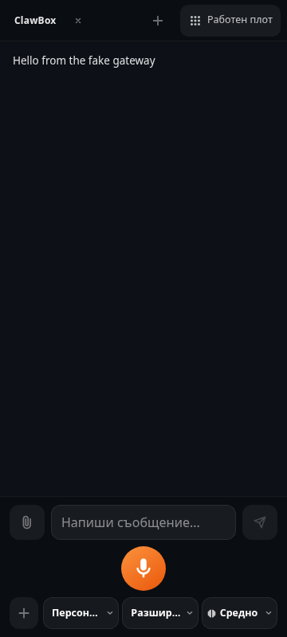

# Portrait phone composer: Stop beside the field, microphone on its own row

Follow-up to #900. With a phone held upright the composer now reads:

1. attachment → text field → **Send** (idle) or the red **Stop** (a reply in
   flight) — the same slot, so the thumb does not move;
2. the record/stop toggle, alone, centred across the chat's full width, 56 px;
3. create and the provider/model/reasoning pickers, as #900 left them.

Landscape phones (e.g. 740×360, 844×390, 390×360) and the desktop keep the #900
layout: there the microphone still sits beside the field and swaps with Send.
Orientation is read with `(orientation: portrait)` (`src/lib/use-portrait.ts`).

## Screenshots

Synthetic gateway, no customer data. Before = beta `f64a7d36`.

| | Before | After |
| --- | --- | --- |
| 390×844, idle |  |  |
| 360×800, Bulgarian, long picker labels |  |  |

With a reply in flight (red Stop in Send's slot):
[390×844](after-390-in-flight.png), [360×800 Bulgarian](after-bg-360-in-flight.png).
Recording state (one control, stop in place of the microphone):
[390×844](after-390-recording.png).
